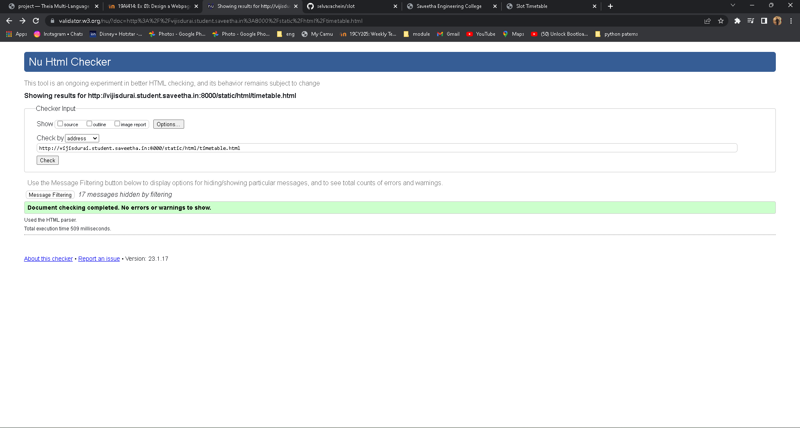

# Experiment_Time_Table

## AIM
To Write a html webpage page to display your timetable.

# ALGORITHM

### STEP 1
create a simple table using table tag

### STEP 2
Add header row using th tag

### STEP 3
Add your timetable

### STEP 4
Execute the program

# CODE
```
<!DOCTYPE html>
<html lang="en">
    <head>
    <title>Slot Timetable</title>
    </head>

    <center>
    
    </center>
    <table border = "4" cellspacing="14" bordercolor="cyan"
    bgcolor="white">
    <tr>
    <th colspan="12">TIME TABLE</th>
    </tr>
    <th colspan=3>Reference Number:</th>
    <th colspan=2>22009065</th>
    <th colspan=2>Name:</th>
    <th colspan=4>DHARANI</th>
    </tr>
    <tr>
    <th>DAYS</th>
    <th>1</th>
    <th>2</th>
    <th>3</th>
    <th>4</th>
    <th rowspan="8">Lunch Break</th>
    <th>5</th>
    <th>6</th>
    <th>7</th>
    <th>8</th>
    </tr>
    <tr>
    <td>MONDAY</td>
    <td>Programming in C P1</td>
    <td>Programming in C P1</td>
    <td>Fundamentals of Web Application Development</td>
    <td>Fundamentals of Web Application Development</td>
    <td>Free Sot</td>
    <td>Free slot</td>
    <td>Communicative English</td>
    <td>Communicative English</td>
    </tr>
    <tr>
    <td>TUESDAY</td>
    <td>Matrix ankd calculus</td>
    <td>Matrix ankd calculus</td>
    <td>Free Slot</td>
    <td>Free Slot</td>
    <td>Fundamentals of Web Application Development</td>
    <td>Fundamentals of Web Application Development</td>
    <td>Programming in C P1</td>
    <td>Programming in C P1</td>
    </tr>
    <tr>
    <td>WEDNESDAY</td>
    <td>Matrix ankd calculus</td>
    <td>Matrix ankd calculus</td>
    <td>Soft Skills</td>
    <td>Soft Skills</td>
    <td>Fundamentals of Web Application Development</td>
    <td>Fundamentals of Web Application Development</td>
    <td>Free slot</td>
    <td>Free Slot</td>
    </tr>
    <tr>
    <td>THURSDAY</td>
    <td>Physcis for IT</td>
    <td>Physcis for IT</td>
    <td>Free Slot</td>
    <td>Free Slot</td>
    <td>Free slot</td>
    <td>Free Slot</td>
    <td>Principles of Chemistry in Engineering</td>
    <td>Principles of Chemistry in Engineering</td>
    </tr>
    <tr>
    <td>FRIDAY</td>
    <td>Principles of Chemistry in Engineering</td>
    <td>Principles of Chemistry in Engineering</td>
    <td>Physcis for IT</td>
    <td>Physcis for IT</td>
    <td>Break</td>
    <td>Digital Principles and System Design</td>
    <td>Communicative English</td>
    <td>Communicative English</td>
    </tr>
    </table>
</html>
```
# OUTPUT


# HTML VALIDATOR


# RESULT
The program for creating slot time table completed successfully.

